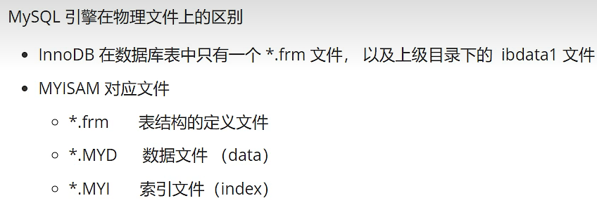

> markdown使用>加空格可以有这样的效果

# 数据库分类
-    关系型数据库
    - MySQL、Oracle、SQL server
    - 通过表和表之间，行和列之间的关系进行数据的存储，学员信息表，考勤表等等
-    非关系型数据库
    - Redis，MongDB
    - 非关系型数据库，对象存储，通过对象的自身属性来决定
    
# 安装MySQL数据库，此时安装的是5.7版本的MySQL
## 用户名是root 密码是123456
-    net start mysql 启动MySQL服务
-    net stop mysql 停止MySQL服务
-    mysql -u root -p然后输入密码进入MySQL服务

```
//通过下列语句修改密码
update mysql.user set authentication_string=password('123456') where user='root' 
and Host = 'localhost';
//刷新权限
flush privileges;
//之后重启MySQL服务即可成功修改密码
```

> 使用SQLyog创建数据库时需要注意


**每一个sqlyog的执行操作，本质就是对应了一个sql，可以在软件的历史记录中查看，如果在实际操作过程中遇到不会的SQL语句可以在历史记录中查看语句**

```
//[]中的语句表示可选
//查看所有的数据库
show databases;
//切换到某一个数据库
use `school`;
//查看数据库中所有的表
show tables;
//显示数据库中所有的表的信息
describe student;
//创建一个数据库
create [if not exists] database class;
//删除数据库
drop database [if exists] class;
//退出连接
exit;
// mysql的注释
-- 单行注释
/*
多行
注释
*/
//MySQL数据库不区分大小写
```
# 数据库的数据类型
> 数值
-    tinyint 十分小的数据 1个字节
- smallint 较小的数据 2个字节
- mediumint 中等大小的数据 3个字节
- int 标准的整数 4个字节
- bigint 较大的数据 8个字节
- float 浮点数 4个字节
- double 浮点数 8个字节
- decimal 字符串形式的浮点数  金融计算的时候一般使用decimal

> 字符串
-    char 字符串固定大小的0-255
- varchar 可变字符串 0-65535
- tinytext 微型文本 2^8-1
- text 文本串 2^16-1

> 时间日期
-    data  YYYY-MM-DD ，日期格式
- time HH：mm：ss 时间格式
- datatime YYYY-MM-DD HH：mm：ss 最常用的时间格式
- timestamp 时间戳 1970.1.1到现在的毫秒数
- year 年份表示

> null
-    没有值，未知

# 数据库的字段属性
`Unsigned`
-    无符号的整数
- 声明了该列不能声明为负数

`zerofill`
-    0填充的
- 不足的位数，使用0来填充

`自增`
-    通常理解为自增，自动在上一条记录的基础上+1
- 通常用来设计唯一的主键~ index，必须是整数类型
- 可以自定义设计主键自增的起始值和增量

`非空NULL not null`
-    假设设置为 not null ，如果不给它赋值，就会报错
- NULL，如果不填写值，默认就是null

`默认`
-    设置默认的值
- 如果没有设置值则为默认值

```sql
/*
每一个表，都必须存在以下五个字段！

id 主键
`version`  乐观锁
is_delete  伪删除
gmt_create 创建时间
gmt_updata 修改时间
*/
```

```sql
//创建一个表
create table if not exists `student`(
    `id` int(4) not null auto_increment comment '学号',
    `name` varchar(30) not null default '匿名' comment '姓名',
    `password` varchar(20) not null default '123456' comment '密码',
    `sex` varchar(2) not null default '女' comment '性别',
    `birthday` datetime default NULL comment '出生日期',
    `address` varchar(100) default null comment '家庭住址',
    `email` varchar(50) default null comment '邮箱',
    primary key(`id`)
)engine=innodb default charset=utf8
```
## 格式
```
create table [if not exists] `表名`(
    '字段名' 列类型 [属性] [索引] [注释],
)[表类型][字符集设置][注释]
```

## 常用命令
```
//如果已有一个数据库，但不知道建立这个数据库的语句可以通过如下语句来查看
show create database school --查看创建数据库的语句
show create table student --查看创建数据表的定义语句
desc student --显示表的结构
```

|            | MYISAM |        INNODB         |
| :--------: | :----: | :-------------------: |
|  事务支持  | 不支持  |         支持          |
| 数据行锁定 | 不支持  |         支持          |
|  外键约束  | 不支持  |         支持          |
|  全文索引  |  支持   |         不支持         |
| 表空间大小 |  较小   | 较大，约为MYISAM的两倍 |

-    MYISAM   节约空间，速度较快
- INNODB    安全性高，事务的处理，多表多用户操作

> 正在物理空间存在的位置
所有的数据库文件都在data目录下，一个文件夹就对应一个数据库
本质还是文件的存储



> 设置数据库表的字符集编码
```
CHATSET=UTF8
```

# 数据表的修改和删除
```
-- 修改表名 ALTER TABLE 旧表名 RENAME AS 新表名
ALTER TABLE student RENAME AS student1
-- 增加表的字段 ALTER TABLE 表名 ADD 字段名 列属性
ALTER TABLE student1 ADD age INT(11)
-- 修改表的字段 （重命名，修改约束）
-- ALTER TABLE 表名 MODIFY 字段名 列属性[]  
ALTER TABLE student1 MODIFY age VARCHAR(11) -- 只可以修改约束及字段类型
-- ALTER TABLE 表名 CHANGE 就名字 新名字 列属性[]
ALTER TABLE student1 CHANGE age age1 INT(1) -- 字段重命名，只可以修改字段名，也可以修改字段类型
-- 删除表的字段 ALTER TABLE 表名 DROP 字段名
ALTER TABLE student1 DROP age1
-- 删除表
DROP TABLE IF EXISTS student1
```

## 数据表数据修改
### 添加
> insert
```
-- 插入语句（添加）
-- insert into 表名([字段名1,字段名2,字段名3...])values('值1','值2','值3'),('值1','值2','值3')
INSERT INTO `student`(`name`) VALUES('尼尼卡');

-- 注意语句与语句之间需要使用;来隔离
-- 一般写插入语句，我们一定要数据和字段一一对应

-- 插入多个字段
INSERT INTO `student`(`name`,`password`,`sex`)
VALUES('尼尼卡1号','111111','男'),
('尼尼卡2号','111111','男'),
('尼尼卡3号','111111','男')
```
语法：``insert into 表名([字段名1,字段名2,字段名3...])values('值1','值2','值3'),('值1','值2','值3')``
注意事项：
-    字段和字段之间使用英文逗号隔开
- 字段是可以省略的，但是后面的值必须要一一对应，不能少
- 可以同时插入多条数据，VALUES后面的值需要使用,来隔开

### 修改
> updata

```
--不指定条件的情况下会修改所有的表，切记不要使用
updata `student` set `name`='修改后的名字'

-- 修改表的属性
UPDATE `student` SET `name`='修改后的名字',`password`='1212' WHERE NAME = '尼尼卡1号';

-- 语法：
-- updata 表名 set colnum_name = value ,[colnum_name = value,....] where [条件]
```

条件：where子句 运算符 id等于某个值，大于某个值，在某个区间内修改...
操作符会返回布尔值
| 操作符    |含义     |范围     |结果     |
| :-- | :-- | :-- | :-- |
|=     |等于     |5=6     |false     |
|<>或!=     |不等于     |5<>6     |true     |
|>     |     |     |     |
|<     |     |     |     |
|  <=   |     |     |     |
|  >=   |     |     |     |
|   between...and...  |在某个范围内     |     |[2,5]     |
|and     |我和你 &&     |5>1 and 1>2     |false     |
|or     |我或你   |5>1 or 1>2     |true     |

注意：
-    colnum_name 是数据库的列，尽量带上` `
- 条件，筛选的条件，如果没有指定，则会修改所有的列
- value，是一个具体的值，也可以是一个变量
- 多个设置的属性之间，使用英文逗号隔开

`CURRENT_DATE在数据库中表示当前的时间`

### 删除
> delete
语法：`delete from 表名` [where 条件]
```
-- 删除数据（避免这样写，会全部删除）
delete from `student`

-- 删除指定数据
delete from `student` where id = 1;
```

>TRUNCATE
作用：完全清空一个数据库表，表的结构和索引约束不会便
```
-- 清空student表
TRUNCATE TABLE `student`
```

> delete 和 TRUNCATE
-    相同点：都能删除数据，都不会删除表头
- 不同点：TRUNCATE会重置自增列，即自增的属性会重新开始计数,而delete不会

## 查询数据


### 指定查询字段
```
-- 查询全部的学生
SELECT * FROM `student`;

-- 查询指定字段
SELECT `name`,`password` FROM `student`;

-- 别名，给结果起一个名字 AS 可以给字段起别名也可以给表起别名
SELECT `name` AS 姓名,`password` FROM `student` AS s ;

-- 函数 Concat(a,b)拼接字符串
SELECT CONCAT('姓名：',`name`) AS 新名字 FROM student;
```
语法：`select 字段,....from 表`

> 有的时候，列名字不是那么见名知意，我们可以起别名 (AS) 字段 as 别名 表名 as 别名

> 去重 distinct
作用：去除SELECT查询出来的结果中的重复的数据，重复的数据只显示一条
```
-- 查询一下有哪些同学参加了考试，成绩
SELECT * FROM result -- 查询全部的考试成绩
SELECT `studentNo` FROM result -- 查询有哪些同学参加了考试
SELECT DISTINCT `studentNo` FROM result -- 发现重复数据，去重
```

> 数据库的列（表达式）
```
SELECT VERSION() -- 查询系统版本（函数）
SELECT 100*3-1 AS 计算结果 -- 用来计算（表达式）
SELECT @@auto_increment_increment -- 查询自增的步长（变量）

-- 学员考试成绩+1分查看
SELECT 	`studentNo`,`studentResult`+1 AS '提分后' FROM result
```
`数据库的表达式：文本值，列，NULL，函数，计算表达式，系统变量....`
select `表达式` from 表

## where条件子句


> 模糊查询：比较运算符号


```

-- like结合 %（代表0到任意个字符） _(一个字符)
SELECT `studentNo`,`studentName` FROM `student`
WHERE studentName LIKE '刘%'

-- 查询姓刘的同学，名字后面只有一个刘
SELECT `studentNo`,`studentName` FROM `student`
WHERE studentName LIKE '刘_'

-- 查询姓刘的同学，名字后面只有两个刘
SELECT `studentNo`,`studentName` FROM `student`
WHERE studentName LIKE '刘__'

-- 查询名字中间有嘉字的同学 %嘉%
SELECT `studentNo`,`studentName` FROM `student`
WHERE studentName LIKE '%嘉%'

-- ======in(具体的一个或者多个值)======
-- 查询1001，1002，1003号学员
SELECT `studentNo`,`studentName` FROM `student`
WHERE studentNo IN (1001,1002,1003);

-- 查询在安徽或者河南洛阳的同学
SELECT `studentNo`,`studentName` FROM `student`
WHERE Address IN('安徽','河南洛阳');

-- ====null not null====

-- 查询地址为空的学生 为null 或者''
SELECT `studentNo`,`studentName` FROM `student`
WHERE address = '' OR address IS NULL

-- 查询有出生日期的同学
SELECT `studentNo`,`studentName` FROM `student`
WHERE `borndate` IS NOT NULL

-- 查询没有出生日期的同学
SELECT `studentNo`,`studentName` FROM `student`
WHERE `borndate` IS  NULL
```

### 联表查询


```
-- 联表查询 join (连接的表) on (判断的条件)
-- where 等值查询

-- 查询参加了考试的同学（学号，姓名，科目编号，分数）
SELECT s.studentNo,studentName,SubjectNo,studentResult
FROM student AS s
INNER JOIN result AS r
WHERE s.studentNo = r.studentNo

SELECT s.studentNo,studentName,SubjectNo,studentResult
FROM student AS s
INNER JOIN result AS r
WHERE s.studentNo = r.studentNo

-- Right Join
SELECT s.studentNo,studentName,SubjectNo,studentResult
FROM student AS s
RIGHT JOIN result AS r
ON s.studentNo = r.studentNo

-- Left join 
SELECT s.studentNo,studentName,SubjectNo,studentResult
FROM student AS s
LEFT JOIN result AS r
ON s.studentNo = r.studentNo

-- 查询缺考的同学
SELECT s.studentNo,studentName,SubjectNo,studentResult
FROM student AS s
LEFT JOIN result AS r
ON s.studentNo = r.studentNo
WHERE studentResult IS NULL

-- 查询参加了考试的同学（学号，姓名，科目名，分数）
SELECT s.studentNo,studentName,SubjectName,studentResult
FROM student AS s
RIGHT JOIN result AS r
ON s.studentNo = r.studentNo
INNER JOIN `subject` sub
ON r.SubjectNo = sub.subjectNo
```

> 自连接

自己的表和自己的表连接，核心：一张表拆成两张一样的表即可


###  分页和排序
> 排序

```
-- 分页limit 和排序 order by

-- 排序：升序ASC ， 降序DESC

-- 查询参加了考试的同学（学号，姓名，科目名，分数）
-- 分数降序
SELECT s.studentNo,studentName,SubjectName,studentResult
FROM student AS s
RIGHT JOIN result AS r
ON s.studentNo = r.studentNo
INNER JOIN `subject` sub
ON r.SubjectNo = sub.subjectNo
ORDER BY studentResult DESC
```

> 分页

语法：`limit(查询起始下表，pagesize)`

```
-- 分页limit 和排序 order by

-- 排序：升序ASC ， 降序DESC

-- 查询参加了考试的同学（学号，姓名，科目名，分数）
-- 分数降序
-- 分页 每一页只显示五条数据
-- 语法：limit 起始值，页面的大小
-- limit 0,5 1-5 该语句通常在SQL语句的最后面
-- limit 1,5 2-6
SELECT s.studentNo,studentName,SubjectName,studentResult
FROM student AS s
RIGHT JOIN result AS r
ON s.studentNo = r.studentNo
INNER JOIN `subject` sub
ON r.SubjectNo = sub.subjectNo
ORDER BY studentResult DESC
LIMIT 5,5
```

### 子查询
where(这个值是计算出来的)


> 子查询即where条件里面也是一组查询语句，这种查询是由里即外的，先查询最里面的where得到查询结果后，再从查询结果里查询到最终结果

### 分组和过滤

```
-- 查询不同课程的平均分，最高分，最低分
-- 核心：（根据不同的课程分组）
SELECT SubjectName,AVG(StudentResult) AS 平均分 ,MAX(StudentResult),MIN(StudentResult)
FROM result AS r
INNER JOIN `subject` AS sub
ON r.`SubjectNo` = sub.`SubjectNo`
GROUP BY r.`SubjectNo` -- 通过什么字段来分组，如果没有分组此例将只会查询出一组数据
HAVING 平均分>80 -- 过滤分组之后的结果
```

# MySQL函数
## 常用函数
```
-- 数学运算
SELECT ABS(-8); -- 绝对值
SELECT CEILING(9.4); -- 向上取整
SELECT FLOOR(9.4); -- 向下取整
SELECT RAND(); -- 返回一个0-1之间的随机数
SELECT SIGN(10); -- 判断一个数的符号 0返回0 负数返回-1 正数返回1

-- 字符串函数
SELECT CHAR_LENGTH('老去的尼尼卡');  -- 字符串的长度
SELECT CONCAT('老去','的','尼尼卡'); -- 拼接字符串
SELECT INSERT('年轻的尼尼卡',1,2,'老去的');  -- 查询，从某个位置开始替换某个长度，即将1-2位置的字符替换成'老去的' 最后结果为'老去的的尼尼卡'
SELECT LOWER('CheerCao'); -- 小写字母
SELECT UPPER('CheerCao'); -- 大写字母
SELECT INSTR('CheerCao','C'); -- 第一次出现子串的位置
SELECT REPLACE('年轻的尼尼卡','年轻的','老去的'); -- 替换出现的指定字符串
SELECT SUBSTR('年轻的尼尼卡',4,6); -- 返回指定的子字符串 (源字符串，截取的位置，截取的长度)
SELECT REVERSE('老去的尼尼卡') -- 反转即从后往前倒过来

-- 时间和日期函数(记住)
SELECT CURRENT_DATE() -- 获取当前日期
SELECT CURDATE() -- 获取当前日期
SELECT NOW() -- 获取当前时间
SELECT LOCALTIME() -- 获取本地时间
SELECT SYSDATE() -- 获取系统时间

SELECT YEAR(NOW())
SELECT MONTH(NOW())
SELECT DAY(NOW())
SELECT HOUR(NOW())
SELECT MINUTE(NOW())
SELECT SECOND(NOW())

-- 系统 
SELECT SYSTEM_USER()
SELECT USER()
SELECT VERSION()
```

## 聚合函数

```
-- 聚合函数
-- 都能统计表中的数据
SELECT COUNT(`name`) FROM student; -- count(字段)，会忽略所有的null值

SELECT COUNT(*) FROM student; -- count(*)，不会忽略null值，本质计算行数
SELECT COUNT(1) FROM student; -- count(*)，不会忽略null值，本质计算行数

SELECT SUM(`id`) AS 总和 FROM `student`;
SELECT AVG(`id`) AS 平均分 FROM `student`;
SELECT MAX(`id`) AS 最高分 FROM `student`;
SELECT MIN(`id`) AS 最低分 FROM `student`;
```
## 数据库级别的MD5加密
什么是MD5？
主要增强算法复杂性和不可逆性
MD5 不可逆，具体的值的MD5是一样的
MD5 破解网站的原理，背后有一个字典，字典里面存储了MD5加密后的值和MD5加密前的值

```
-- MD5 加密
CREATE TABLE `testmd5`(
 `id` INT(5) NOT NULL,
 `name` VARCHAR(20) NOT NULL,
 `pwd` VARCHAR(20) NOT NULL,
 PRIMARY KEY (`id`)
)ENGINE=INNODB DEFAULT CHARSET=utf8

-- 明文密码
INSERT INTO `testmd5` VALUES(1,'zhangsan','123456')

ALTER TABLE `testmd5` MODIFY `pwd` VARCHAR(50) -- 由于建表时设置的字段长度太短，重新设置字段长度

-- 加密 加密时需要注意字段长度，如果规定值字段较短则无法进行加密，最好设置字段长度为50
UPDATE `testmd5` SET `pwd`=MD5(pwd) WHERE `id` = 1

UPDATE `testmd5` SET `pwd`=MD5(pwd) -- 加密全部的密码

-- 插入的时候加密
INSERT INTO `testmd5` VALUES(2,'xiaoming',MD5('123456'))

-- 如何校验：将用户传递进来的密码，进行md5加密，然后比对加密后的值
SELECT * FROM `testmd5` WHERE `name`='xiaoming' AND pwd = MD5('123456') 
```

# 事务
## 什么是事务
要么都成功，要么都失败

1.SQL执行 A给B转载
2.SQL执行 B 收到A的前
这两个是需要同时成功或同时失败的

> 事务原则：ACID原则 原子性，隔离性，持久性 

**原子性**
要么都成功，要么失败
**一致性**
事务前后的数据完整性要保证一致
**持久性**
事务一旦提交则不可逆，被持久化到数据库中
**隔离性**
事务的隔离性是多个用户并发访问数据库时，数据库为每一个用户开启事务，不能被其他的事务操作数据所干扰，多个并发事务之间要相互隔离

```
-- 事务
-- mysql 是默认开启事务自动提交的
SET autocommit = 0 /* 关闭 */
SET autocommit = 1 /* 开启（默认的） */

-- 手动处理事务
SET autocommit = 0 -- 关闭自动提交

-- 事务开启
START TRANSACTION -- 标记一个事务的开始，从这个之后的SQL都在同一个事务内

INSERT xx
INSERT xx

-- 提交：持久化（成功）
COMMIT
-- 回滚：回到原来的样子（失败）
ROLLBACK

-- 事务结束
SET autocommit = 1 -- 开启自动提交

-- 设置一个事务的保存点 （非必需）
SAVEPOINT 保存点名
ROLLBACK TO SAVEPOINT 保存点名 -- 回滚到保存到
RELEASE SAVEPOINT 保存点名 -- 删除指定保存点

```

# 索引
> 索引是帮助MySQL高效获取数据的数据结构
## 索引的分类
> 在一个表中，主键索引只能有一个，唯一索引可以有多个
-    主键索引（PRIMARY KEY）
        -  唯一标示，主键不可以重复，只能有一个列作为主键
- 唯一索引（UNIQUE KEY）
    - 避免重复的列出现，唯一索引可以重复，多个列都可以标示为唯一索引
- 常规索引（KEY/INDEX）
    - 默认的，index,key关键字俩设置
- 全文索引（FullText）
    - 在特点的数据库引擎下才有，MyISAM
    - 快速定位索引
> 索引主要用于大数据量，在数据量大是使用索引查询速度会快很多
## 索引原则
- 索引不是越多越好
- 不要对经常变动的数据加索引
- 小数据量的表不需要加索引
- 索引一般加在常用来查询的字段上

# 权限管理
## 用户管理
> SQL yog 可视化管理

> SQL命令
```
-- 创建用户 CREATE USER 用户名 IDENTIFIED BY '密码'
CREATE USER cheer IDENTIFIED BY '123456'

-- 修改密码（修改当前用户的密码）
SET PASSWORD = PASSWORD('123456')

-- 修改密码（修改指定用户的密码）
SET PASSWORD FOR cheer = PASSWORD('123456')

-- 重命名 RENAME USER 旧名字 TO 新名字
RENAME USER cheer TO cheercao

-- 用户授权 ALL PRIVILEGES 全部的权限  *.* 表示库.表
-- 除了给别人授权，其他都可以干
GRANT ALL PRIVILEGES ON *.* TO cheercao

-- 查看权限
SHOW GRANTS FOR cheercao -- 查看指定用户的权限
SHOW GRANTS FOR root@localhost -- 查看管理员权限

-- 撤销权限 REVOKE 哪些权限，在哪个库，哪个表，给谁撤销
REVOKE ALL PRIVILEGES ON *.* FROM cheercao

-- 删除用户
DROP USER cheercao
```

## MySQL 备份
MySQL数据库备份的方式
-    直接拷贝物理文件
- 在SQLyog可视化备份和导出
- 使用命令行导出和备份
```
#导出一张表
#mysqldump -h主机 -u用户名 -p密码 数据库 表名 >物理磁盘位置/文件名
mysqldump -hlocalhost -uroot -p123456 school student >C:/date.sql
#导出多张表
#mysqldump -h主机 -u用户名 -p密码 数据库 表1 表2 表3 >物理磁盘位置/文件名
mysqldump -hlocalhost -uroot -p123456 school student result >C:/date.sql
#导出数据库
#mysqldump -h主机 -u用户名 -p密码 数据库 >物理磁盘位置/文件名
mysqldump -hlocalhost -uroot -p123456 school >C:/date.sql
#导入
#登录的情况下，切换到指定的数据库
#source 备份文件
source c:/date.sql 
```
# 三大范式

**第一范式**

原子性：保证每一列不可再分

**第二范式**

前提：满足第一范式

每张表只描述一件事情

**第三范式**

前提：满足第一和第二范式

第三范式需要确保数据表中的每一列数据都和主键直接相关，而不能间接相关

# JDBC

Java连接数据库步骤：

1.加载驱动

2.连接数据库DriverManager

3.获得执行sql的对象 Statement

4.获得返回的结果集

5.释放连接

```java
//使用这种方法连接数据库有SQL注入的风险
public static void main(String[] args) throws ClassNotFoundException, SQLException {
        //1.加载驱动
        Class.forName("com.mysql.jdbc.Driver");
        //2.用户信息
    	//url中的mysql代表协议，localhost代表主机地址，3306端口号，school代表数据库
        String url = "jdbc:mysql://localhost:3306/school?useUnicode=true&characterEncoding=utf8&useSSL=true";
        String username = "root";
        String password = "123456";
        //3.连接成功;
    	//connection 代表数据库
        Connection connection = DriverManager.getConnection(url,username,password);

        //4.执行sql的对象
        Statement statement = connection.createStatement();
        statement.executeQuery(); //查询操作，返回resultSet
        statement.execute();  //执行所有的SQL
        statement.executeUpdate(); //更新、插入、删除都是用这个，返回一个受影响的行数
    	//5.执行sql的对象去执行sql语句
        String sql = "SELECT * FROM student";
        ResultSet resultSet = statement.executeQuery(sql);
        //ResultSet结果集，封装了所有的查询结果
    	while (resultSet.next()){
            System.out.println("id="+resultSet.getObject("id"));
            System.out.println("name="+resultSet.getObject("name"));
        }
        //6.释放连接
        resultSet.close();
        statement.close();
        connection.close();
    }
```

```java
// 读取resources文件里面的配置信息
InputStream in = jdbcutile.class.getClassLoader().getResourceAsStream("db.properties");
Properties properties = new Properties();
properties.load(in);
//*.properties都放在resources里面
```

## DBCP maven 

```maven
<dependency>
            <groupId>commons-dbcp</groupId>
            <artifactId>commons-dbcp</artifactId>
            <version>1.4</version>
        </dependency>
```

