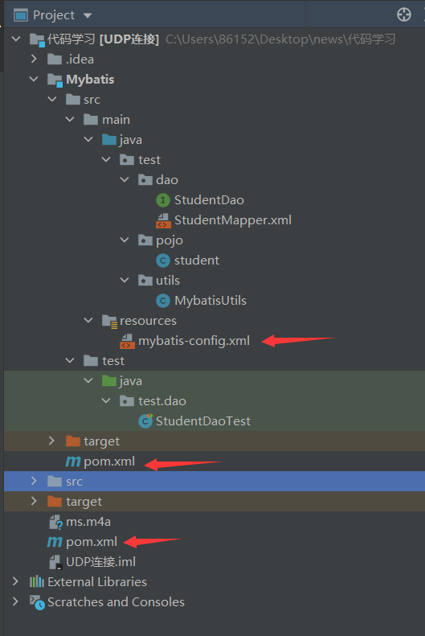

# 1.简介

## 1.1什么是Mybatis

- MyBatis 是一款优秀的**持久层框架**

- 它支持自定义 SQL、存储过程以及高级映射。
- MyBatis0 免除了几乎所有的 JDBC 代码以及设置参数和获取结果集
- MyBatis 可以通过简单的 XML 或注解来配置和映射原始类型、接口和 Java POJO（Plain Old Java Objects，普通老式 Java 对象）为数据库中的记录


## 1.2持久化

数据持久化

- 持久化就是将程序的数据在持久状态和瞬时状态转化的过程
- 内存：断电即失
- 数据库（jdbc），io文件持久化

## 1.3持久层

Dao层，Service层，Controller层…

- 完成持久化工作的代码块
- 层界限十分明显

# 2.Mybatis实例



mybatis依赖

```xml
<dependency>
            <groupId>org.mybatis</groupId>
            <artifactId>mybatis</artifactId>
            <version>3.5.2</version>
        </dependency>
```

mybatis-config.xml配置

```xml
<?xml version="1.0" encoding="UTF-8" ?>
<!DOCTYPE configuration
        PUBLIC "-//mybatis.org//DTD Config 3.0//EN"
        "http://mybatis.org/dtd/mybatis-3-config.dtd">
<configuration>
    <environments default="development">
        <environment id="development">
            <transactionManager type="JDBC"/>
            <dataSource type="POOLED">
                <property name="driver" value="com.mysql.jdbc.Driver"/>
                <property name="url" value="jdbc:mysql://localhost:3306/school?useSSL=true&amp;useUnicode=true&amp;characterEncoding=UTF-8"/>
                <property name="username" value="root"/>
                <property name="password" value="123456"/>
            </dataSource>
        </environment>
    </environments>
    <!--每一个Mapper.XML都需要在Mybatis核心配置文件中注册！-->
    <mappers>
        <mapper resource="test/dao/StudentMapper.xml"/>
    </mappers>
</configuration>
```

StudentMapper.xml配置

```xml
<?xml version="1.0" encoding="UTF-8" ?>
<!DOCTYPE mapper
        PUBLIC "-//mybatis.org//DTD Mapper 3.0//EN"
        "http://mybatis.org/dtd/mybatis-3-mapper.dtd">
<!-- 注意配置namespace的路径 注明绑定的是哪个接口   -->
<mapper namespace="test.dao.StudentDao">
    <!-- select查询语句  -->
    <!-- id 是 注明绑定的是接口的哪个方法 resultType注明返回数据的类，这里是student类 -->
    <select id="getStudentList" resultType="test.pojo.student">
        select * from school.student
    </select>
</mapper>
```

==发生此种情况解决方法如下，以后每次使用Mybatis都需要在pom.xml中添加此配置来防止找不到资源的问题==

```java
//注意此错在之后可能会经常遇到
org.apache.ibatis.binding.BindingException: Type interface test.dao.StudentDao is not known to the MapperRegistry. //类型接口在mapper里面没有注册
//每一个Mapper.XML都需要在Mybatis核心配置文件中注册！
//找不到资源文件，由于test下的用例不和配置文件在一起
Could not find resource test/dao/StudentMapper.xml
//发生此种情况解决方法如下，以后每次使用Mybatis都需要在pom.xml中添加此配置来防止找不到资源的问题
    <!--在Build中配置resources，来防止资源导出失败的问题 -->
    <build>
        <resources>
            <resource>
                <directory>src/main/java</directory>
                <includes>
                    <include>**/*.xml</include>
                    <include>**/*.properties</include>
                </includes>
            </resource>

            <resource>
                <directory>src/main/resources</directory>
                <includes>
                    <include>**/*.xml</include>
                    <include>**/*.properties</include>
                </includes>
            </resource>
        </resources>
    </build>
```

**1.先写Mybatis的工具类**

**2.写Mybatis的配置文件**

**3.写实体类**

**4.写实体类的接口和xml配置文件**

**5.写test测试配置文件是否正确**

# 3.CRUD

## 1.namespace

namespace中的包名要和Dao/Mapper接口的包名一致

## 2.select

选择查询语句

- id：就是对应的namespace中的方法名
- resultType：Sql语句执行的返回值
- paramenterType：参数类型

1.编写接口

```java
//插入一个学生
    int InsertStudent(student stu);
```


2.编写对应的mapper中的sql语句

```xml
<!--根据id查询学生-->
    <select id="getStudentById" parameterType="int" resultType="test.pojo.student">
        select * from school.student where id = #{id}
    </select>
```


3.测试

```java
@Test
    public void test(){
        //测试查询所有学生
        //第一步：获得SqlSession对象
        SqlSession sqlSession = MybatisUtils.getSqlSession();
        //方式一：getMapper 推荐使用
        // 通过mapper获得接口的实体类，然后就可以直接调用方法
        StudentDao studentDao = sqlSession.getMapper(StudentDao.class);
        List<student> studentList = studentDao.getStudentList();
        //方式二 不推荐使用
       // List<student> studentList = sqlSession.selectList("test.dao.StudentDao.getStudentList");
        for (student student : studentList) {
            System.out.println(student);
        }
        sqlSession.close();
    }
```

## 3.insert

```xml
<!--插入一个学生-->
    <!--对象中的属性可以直接取出来-->
    <insert id="InsertStudent" parameterType="test.pojo.student" >
        insert into school.student (id,`name`,password,sex,birthday,address,email)
        values (#{id},#{name},#{password},#{sex},#{birthday},#{address},#{email});
    </insert>
```

## 4.update

```xml
<!--修改一个学生信息-->
    <!--对象中的属性可以直接取出来-->
    <update id="updateStudent" parameterType="test.pojo.student">
        update school.student
        set `name` = #{name},
            password=#{password},
            sex = #{sex}
        where id = #{id};
    </update>
```

## 5.delete

```xml
<!--删除一个学生的信息-->
    <delete id="deleteStudent" parameterType="int">
        delete from school.student where id=#{id};
    </delete>
```

注意点：

- 增删改需要提交事务
- sqlSession需要close关闭，不要忘记
